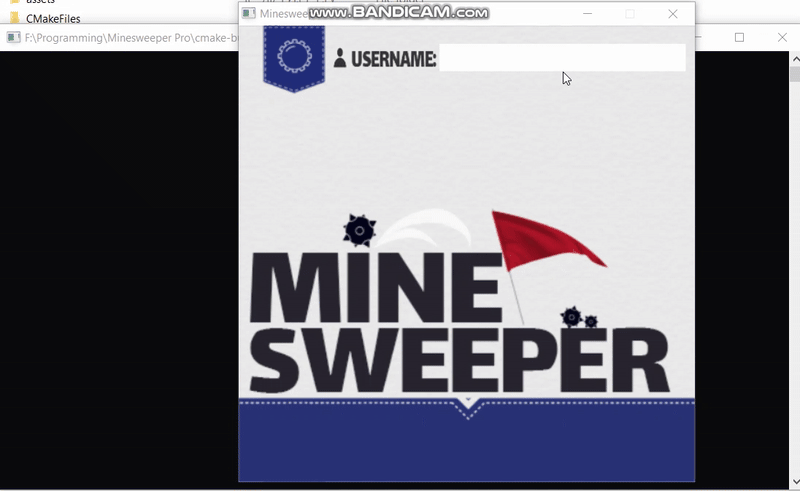
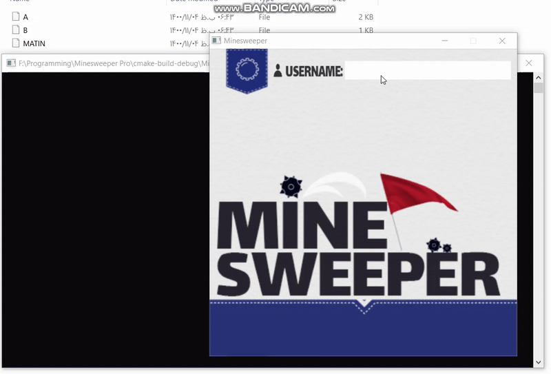

# 💣 Minesweeper

This is a complete, graphical implementation of the classic Minesweeper game, developed in C++ as a project for the **Introduction to Programming** course. The game uses the **SDL library** (via a custom wrapper, SBDL) to render the user interface and handle all interactions, providing a smooth and responsive experience.

-----

## ✨ Key Features

This implementation of Minesweeper is packed with features to enhance gameplay and user experience:

  * **Dynamic Map Generation**: Instantly create **randomly generated** game boards, so no two games are ever the same.
  * **Multiple Game Modes**:
      * Choose from **3 default map sizes** for a quick game.
      * Create a **custom map** by setting your own board dimensions and number of mines for a unique challenge.
  * **Game Persistence**:
      * **Save** your current game progress to a file at any time.
      * **Load** a previously saved game to continue where you left off.
      * **Delete** old saved maps you no longer need.
  * **Competitive Play**: Track and compare your best times on the **leaderboard**.
  * **User Switching**: Easily **change the active user** to maintain separate high scores and saved games for different players.
  * **Smart Gameplay Mechanics**:
      * Enjoy an efficient playthrough with **automatic clearing** of all adjacent empty cells when you click on an empty square.
      * Right-click to **mark and unmark cells** with flags to keep track of suspected mine locations.

-----

## 🎮 Gameplay Demo

Below are demonstrations of the game's menu system and core gameplay.

### **Menu Navigation and Custom Games**

-----

### **Core Gameplay**

-----

## 🛠️ Technologies Used

  * **C++**: The core logic of the game is written in C++.
  * **SDL (Simple DirectMedia Layer)**: Used for rendering all graphics, handling user input (mouse and keyboard), and managing the game window. This project uses a lightweight wrapper called **SBDL**.

-----

## 🚀 How to Compile and Play

To compile and run this project, you'll need a C++ compiler and the SDL2 library installed on your system.

### **1. Prerequisites**

  * **C++ Compiler**: A modern C++ compiler like `g++` or `Clang`.
  * **SDL2 Libraries**: You need the main SDL2 library along with the `SDL2_image` and `SDL2_ttf` extensions for handling images and fonts.

### **2. Installation**

  * Visit this [link](https://docs.google.com/document/d/1HN9np7kDS9zph0zncIxFYezDnyOSDNuaJPQjYtQkXKY/) for a step-by-step installation guide on SBDL
